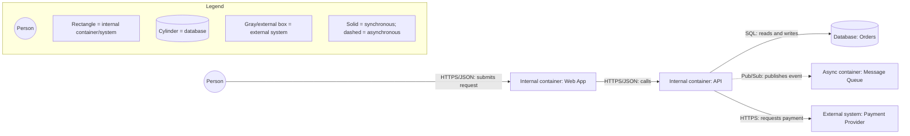

# Implementing architecture diagramming best practices

Start with one audience and one question. A diagram should tell one story, not attempt to model the entire system. Define the scope, audience, status, date/version, and author before choosing the notation.

## 1. Choose the right abstraction and diagram type

Use the C4 levels consistently:

- **Context:** people, the system being designed, and external systems. Use it for executives, product, and mixed stakeholder audiences.
- **Container:** deployable building blocks inside one system, such as a web app, API, worker, database, or file store. Use it for architects and developers; “container” means a deployable unit, not necessarily a Docker container.
- **Component:** modules inside one container, such as controllers, services, and repositories. Use it for developers.
- **Code:** classes or implementation details inside one component; use it sparingly or generate it when possible.

Use a sequence diagram for protocol/API timing, an ERD for data relationships, a state diagram for lifecycle changes, a flowchart for decisions, and a deployment diagram for mapping containers to infrastructure. Do not mix these concerns into a single crowded view.

## 2. Make notation explicit and consistent

Choose a direction—`LR` for flows and wide infrastructure, or `TD` for hierarchies—and use it consistently. Reuse one shape for each concept: people, internal systems/containers, external systems, and databases. Use semantic colors only, for example blue for internal systems, gray for external systems, green for people, and a cylinder for a database.

Every diagram needs a legend that explains shapes, colors, line styles, and arrow meaning. State whether solid lines mean synchronous calls, dashed lines mean asynchronous messaging, and whether arrows describe dependency or data flow. Define every acronym in the diagram or its notes.

## 3. Label relationships and boundaries

Label every edge with a precise verb and, where useful, a protocol or technology: `HTTPS/JSON`, `gRPC`, `SQL`, or `publishes events`. Make direction unambiguous. Show trust or deployment boundaries such as a browser-to-API boundary, VPC, firewall, or external-provider boundary when they affect the design or security story.

Keep the abstraction level uniform. A container diagram should not contain database columns, class names, CPU/RAM details, or unrelated implementation internals. Keep node count manageable—split a view when it becomes cluttered rather than shrinking text or adding unexplained boxes.

## 4. Record metadata and validate

Include a title, scope, status (`Draft`, `Proposed`, or `Implemented`), date/version, and author. Before publishing, check that:

1. the diagram answers its stated question for its intended audience;
2. every node is connected and every edge is labeled;
3. the direction of requests, responses, dependencies, and asynchronous flows is clear;
4. shapes, colors, and line styles match the legend;
5. external systems and security boundaries are distinguishable;
6. there are no unexplained acronyms, mixed abstraction levels, or dead ends; and
7. the diagram still renders legibly in the target documentation tool.

A small, governed Mermaid view is preferable to a comprehensive but unreadable one:

The example is a container-level story: it names technology-neutral responsibilities and communication contracts without mixing in table columns or classes. If the audience needs deployment detail, create a separate deployment view mapping `Web`, `API`, `Queue`, and `DB` to hosts, clusters, or cloud services.

