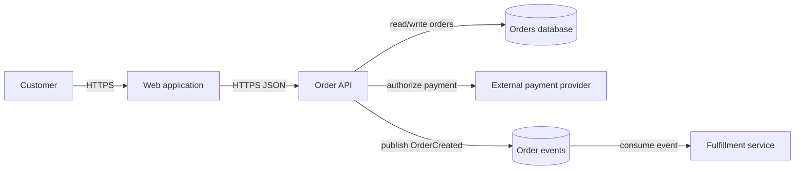

# Quick-start architecture diagram

Start with a context view, then add only the detail needed to explain one important flow. For example, the following Mermaid diagram shows a small online-ordering system:

Reading the diagram: the customer uses the web application; the application calls the order API; the API owns order data in the orders database, calls the external payment provider, and publishes an `OrderCreated` event. The fulfillment service consumes that event asynchronously.

To make this a useful maintained architecture view:

1. Add a title, purpose, environment, owner, and date. State whether the payment provider and fulfillment service are inside or outside the organization’s system boundary.
2. Add a legend if the notation is not obvious. In this example, arrows represent communication, `HTTPS` is synchronous request/response, and the event path is asynchronous.
3. Mark important boundaries. For example, put the external payment provider outside the system boundary and show the trust boundary between the public web edge and internal services.
4. Add only decision-relevant details, such as authentication, encryption, timeout/retry behavior, idempotency for payment, and who owns the order database. Put detailed request ordering in a separate sequence diagram.
5. Keep the Mermaid source in version control and update it when the API, event contract, ownership, or deployment topology changes.

This is a starting point, not a complete design. The next view should normally be a sequence diagram for checkout and a deployment view if availability, networking, or scaling is part of the decision.

