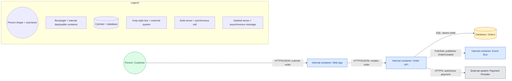

# Quick-start: a governed Mermaid container diagram

Use a C4 Container view when the question is “What are the main deployable parts of this system, and how do they communicate?” The following example is intentionally small and shows one story.

**Title:** Order submission — C4 Container view  
**Scope:** Order system and its immediate integrations  
**Audience:** Architects and developers  
**Status:** Proposed  
**Version/date:** v1.0, 2026-07-11  
**Author:** Architecture team

How to adapt it:

1. Replace the example nodes with the system’s real actors, containers, and immediate external systems. Keep this view at container level; do not add table columns or classes.
2. Label every relationship with the action plus protocol or transport. Keep arrows directional so a reader can distinguish calls from published events.
3. Apply a consistent visual style in the renderer: for example, blue internal containers, gray external systems, green people, and a cylinder for databases. The legend must define those choices.
4. Add deployment information in a separate C4 Deployment view if the question includes hosts, clusters, VPCs, firewalls, or regions. Add a sequence diagram instead if the question is timing, retries, or race conditions.
5. Recheck the finished diagram for connected nodes, readable whitespace, defined acronyms, security/trust boundaries, and current metadata.

This is a proposed architecture, so it should be reviewed with its audience and updated with a new version/status when the implementation changes.

