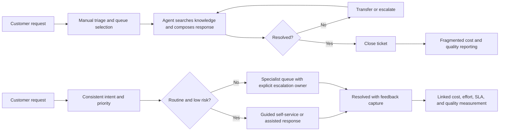

# Business Requirements Document (BRD-lite): Customer Support Ticket Resolution Cost Reduction

**Status**: Draft  
**Owner**: BA Lead (recommended)  
**Last Updated**: 2026-07-11

## 1. Executive Summary

- **Purpose**: Reduce the fully loaded cost of resolving customer-support tickets while preserving customer outcomes, service levels, and safe escalation.
- **Desired Outcome**: Within six months of pilot approval, lower cost per resolved ticket by 20% against a measured trailing-90-day baseline, with no material deterioration in customer satisfaction or SLA performance.
- **Sponsor**: VP, Customer Support (recommended; confirm named sponsor).
- **Validation Owner**: Director, Support Operations (recommended; owns baseline, pilot readout, and acceptance decision).
- **Handoff Owner**: BA Lead. The next accountable team member is the Product Manager, who will convert approved business requirements into a PRD.

The organization should first measure the baseline across the selected channels and ticket categories. The target is relative to that measured baseline rather than an invented currency value.

## 2. Business Objectives

### BRD-OBJ-001: Reduce unit resolution cost

- **Objective Statement**: Reduce fully loaded cost per resolved ticket by at least 20% from the trailing-90-day baseline within six months of pilot approval.
- **Baseline**: Actual labor minutes, loaded labor rate, vendor cost, and automation cost per resolved ticket for the selected channels and categories during the 90 days before pilot start.
- **Target**: Cost per resolved ticket <= 80% of baseline by the end of month six.
- **Owner**: Director, Support Operations.
- **Candidate PRD link**: REQ-001.
- **SMART Check**: Specific to unit cost, measurable against a defined period, achievable through focused high-volume categories, relevant to support economics, and time-bound.

### BRD-OBJ-002: Reduce avoidable agent effort

- **Objective Statement**: Reduce median agent handling minutes for in-scope resolved tickets by 25% from baseline within six months, without increasing reopen or repeat-contact rates by more than two percentage points.
- **Baseline**: Median handling minutes and 30-day reopen/repeat-contact rate for the same ticket population during the trailing 90 days.
- **Target**: Handling minutes <= 75% of baseline; reopen/repeat-contact rate no more than baseline +2 percentage points.
- **Owner**: Support Operations Manager.
- **Candidate PRD link**: REQ-002.
- **SMART Check**: Ties efficiency to a measurable guardrail and a defined delivery window.

### BRD-OBJ-003: Protect customer and service outcomes

- **Objective Statement**: Maintain customer satisfaction at or above the pre-pilot baseline and maintain at least 95% SLA compliance throughout the pilot and the first full month after rollout.
- **Baseline**: Trailing-90-day CSAT, SLA compliance, escalation rate, and complaint rate for the in-scope population.
- **Target**: CSAT >= baseline, SLA compliance >= 95%, and escalation/complaint rates no higher than baseline +2 percentage points unless the validation owner approves a documented exception.
- **Owner**: Customer Experience Director.
- **Candidate PRD link**: REQ-003.
- **SMART Check**: Defines measurable quality and service guardrails over a specific pilot period.

## 3. Current State (AS-IS)

1. A customer submits a request through chat, email, or the support portal.
2. An agent or queue manager manually interprets the request, selects a queue, and looks for relevant knowledge.
3. Agents often recreate answers, gather information already available elsewhere, or transfer tickets when the first routing decision is wrong.
4. Repetitive low-risk questions consume the same human effort as exceptions, while escalation criteria vary by agent.
5. Cost, handling time, repeat contacts, and outcome quality are reported in separate systems, making it difficult to see which interventions reduce cost without shifting work to another queue.

Primary pain points are repetitive work, inconsistent routing and responses, avoidable handoffs, slow knowledge retrieval, and weak linkage between effort and customer outcome. The business consequence is higher labor cost per resolution and less capacity for complex cases.

## 4. Future State (TO-BE)

Support has a measured, governed operating model for the highest-volume, lowest-risk ticket categories. Customers receive a consistent first response or self-service path; agents receive relevant guidance and reusable response content; tickets that require judgment are routed to the right owner with clear escalation criteria. The organization can compare cost, effort, quality, and SLA outcomes by category and channel.

The business outcome—not a prescribed technical design—is that routine work requires less human effort, exceptions receive appropriate human attention, and every cost-saving change is evaluated against customer and service guardrails.

## 5. Process Diagram

## 6. Stakeholders and Approval Ownership

| Stakeholder | Role | Impact | Approval Needed |
| --- | --- | --- | --- |
| VP, Customer Support | Executive sponsor and decision-maker | Owns cost and service tradeoff | Yes: business case and rollout gate |
| Director, Support Operations | Validation owner | Owns baseline, pilot operations, and acceptance evidence | Yes: baseline, pilot results, and acceptance |
| Frontline support agents | Primary operators | Workflow and knowledge changes affect daily handling | Consulted; agent-readiness sign-off |
| Customer Experience Director | Quality owner | Protects CSAT, complaint, and escalation outcomes | Yes: quality guardrails |
| Support QA/Training Lead | Control owner | Defines evaluation and coaching impact | Yes: quality measurement approach |
| Finance Business Partner | Value reviewer | Validates loaded cost and savings calculation | Yes: cost baseline and benefit model |
| Product Manager | PRD handoff owner | Converts approved business outcomes into product scope | Yes: PRD acceptance of business requirements |
| Engineering/Data owners | Delivery and measurement partners | Provide implementation and reporting feasibility input | Consulted; no BRD business-approval authority |
| Customers | Beneficiaries and affected users | Experience response quality and effort | Feedback/validation, not internal approval |

## 7. Scope and Boundaries

### In Scope

- A pilot covering the top five to ten high-volume, low-risk ticket categories, selected using baseline volume and effort data.
- Customer support channels included in the baseline, initially recommended as web and chat; email may be added if measurement is comparable.
- Business rules for intent classification, prioritization, routing, escalation, knowledge ownership, and quality guardrails.
- Reusable response and guidance content, agent enablement, and a feedback loop for incorrect or stale guidance.
- A benefits scorecard covering cost per resolution, handling time, repeat contacts, CSAT, SLA compliance, escalations, and complaints.

### Out of Scope

- Replacing the customer relationship or ticketing platform.
- Workforce reduction decisions; savings may be realized as capacity, avoided hiring, or lower vendor spend only after Finance validates the operating plan.
- Automation of high-risk, regulated, refund, safety, or exception cases without separate approval.
- A company-wide rollout before pilot results meet the stated guardrails.

### Assumptions

- Ticket volume, handling time, labor cost, outcome, and channel data can be joined at least at category and period level.
- Support leadership can nominate a pilot queue and provide agent time for discovery, training, and validation.
- A small group of high-volume, low-risk categories will provide enough volume to establish a meaningful comparison.
- Sponsor and role names are recommendations because the request did not provide an organization chart.

### Constraints

- Savings must not be reported from deflection alone if contacts become repeat tickets or complaints.
- Customer and ticket data must follow applicable privacy, retention, and access policies.
- Baseline and pilot cohorts must use the same cost and outcome definitions, or differences must be disclosed.

## 8. Business Value

- **Value Type**: Cost reduction, capacity, cycle time, and customer-experience risk control.
- **Expected Benefit**: At least 20% lower cost per resolved ticket and 25% lower median handling minutes for the pilot population, subject to Finance validation. Annual gross benefit can be calculated as `annual in-scope resolved tickets x baseline cost per ticket x realized percentage reduction`.
- **Additional Value**: More agent capacity for complex cases, faster routine resolution, more consistent answers, and earlier detection of knowledge gaps.
- **Cost / Tradeoff**: Baseline analysis, content curation, agent participation, training, reporting, change management, and any automation/vendor cost. A poor-quality intervention can increase repeat contacts and erode trust, so quality guardrails are a release condition.

## 9. Risks and Mitigations

| Risk | Impact | Mitigation | Owner |
| --- | --- | --- | --- |
| The measured baseline is incomplete or mixes incompatible cost definitions | Savings claim is not credible | Finance and Support Operations approve one cost and cohort definition before pilot | Finance Business Partner |
| Routine guidance is wrong, stale, or incomplete | Repeat contacts, complaints, or escalations increase | Assign content owners, review dates, agent feedback, and rollback criteria | Support QA/Training Lead |
| Efficiency gains shift work to another queue | Apparent savings hide higher total cost | Track end-to-end resolution, transfers, repeat contacts, and escalations | Support Operations Manager |
| Agents do not trust or use the new guidance | Benefits are not realized | Include agents in pilot design, measure adoption, and provide training | Support Operations Director |
| Sensitive or exceptional tickets are handled too aggressively | Customer or compliance harm | Keep high-risk categories out of pilot and require human escalation rules | Customer Experience Director |

## 10. Stakeholder Validation and Acceptance Window

- Support Operations, Finance, CX/QA, and a representative agent group review the baseline definition before pilot launch.
- The validation owner distributes the pilot scorecard and evidence pack within five business days of the pilot end.
- Approvers have five business days to accept the pilot, request a remediation cycle, or reject rollout. Silence is not approval.
- A remote delivery team may proceed to PRD preparation only after the BA Lead records the baseline, owners, scope fence, and approval decision in the handoff package.

## 11. Glossary

| Term | Meaning | Owner |
| --- | --- | --- |
| Cost per resolved ticket | Fully loaded support cost divided by resolved tickets for a defined cohort and period | Finance Business Partner |
| Handling minutes | Agent effort time attributable to a ticket under the agreed measurement definition | Support Operations |
| Repeat contact | A new or reopened contact about the same customer issue within the agreed observation window | CX Analytics |
| Deflection | A customer need resolved without a ticket being created; must be checked against repeat contacts and complaints | CX Analytics |
| SLA compliance | Percentage of in-scope tickets meeting the agreed service-level commitment | Support Operations |
| CSAT | Customer satisfaction measure and survey population agreed for the pilot | Customer Experience |

## 12. PRD Handoff Notes

- Candidate PRD requirement links:
  - **REQ-001**: The product scope must support measurement of cost and effort by comparable ticket cohort.
  - **REQ-002**: The product scope must reduce avoidable handling effort for approved low-risk categories while recording transfers and repeat contacts.
  - **REQ-003**: The product scope must expose quality and SLA guardrails and support safe escalation for exceptions.
- Open decisions for PRD: final pilot categories and channels; baseline data sources; approved risk categories; target operating model for realized capacity; reporting frequency; rollback authority.
- Functional behavior, interfaces, and technical constraints belong in the PRD/SRS rather than this BRD.

## 13. Outcome Report Seed

- **feature_status**: `draft - awaiting sponsor and validation-owner approval`
- **requirement_trace**: `BRD-OBJ-001 -> REQ-001; BRD-OBJ-002 -> REQ-002; BRD-OBJ-003 -> REQ-003`
- **Completed evidence**: Business objective, provisional baseline definition, target metrics, AS-IS/TO-BE, scope fence, value hypothesis, stakeholder/approval map, risk register, and glossary.
- **Missing evidence**: Named sponsor and approvers, actual 90-day baseline, pilot category/channel selection, Finance-approved savings model, and pilot acceptance decision.
- **Decision needed**: Approve the pilot boundary and baseline measurement plan.
- **Recommended next workflow**: `plan-feature` after the named owners approve this BRD-lite and the missing evidence is collected.

