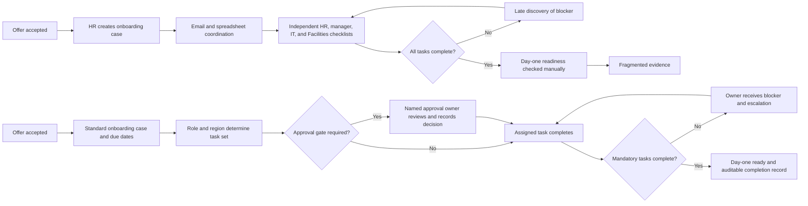

# Business Requirements Document (BRD-lite): Employee Onboarding Automation

**Status**: Draft  
**Owner**: BA Lead (recommended)  
**Last Updated**: 2026-07-11

> **Working assumption**: “Onboarding” means onboarding employees from accepted offer through the first 30 days. If the request instead means customer, partner, or vendor onboarding, the actors, controls, and metrics must be re-baselined before approval.

## 1. Executive Summary

- **Purpose**: Reduce manual coordination in employee onboarding while ensuring every new hire receives the right preparation, access, equipment, policy acknowledgements, and human support on time.
- **Desired Outcome**: Within two quarters of approval, make at least 95% of standard new hires day-one ready, reduce median time from accepted offer to day-one readiness by 30%, and create auditable approval evidence for all controlled access and policy steps.
- **Sponsor**: Chief People Officer or VP, People Operations (recommended).
- **Validation Owner**: Director, HR Operations (recommended; owns process acceptance and evidence).
- **Handoff Owner**: BA Lead. The next accountable team member is the Product Manager, who owns the PRD handoff after business approval.

## 2. Business Objectives

### BRD-OBJ-001: Improve day-one readiness

- **Objective Statement**: Increase the share of standard employees who have all mandatory day-one prerequisites complete by their start date to at least 95% within two quarters.
- **Baseline**: Percentage of standard hires meeting the current day-one readiness definition during the previous six months, segmented by region and worker type.
- **Target**: >=95% of the approved pilot population day-one ready for two consecutive monthly cohorts.
- **Owner**: Director, HR Operations.
- **Candidate PRD link**: REQ-001.
- **SMART Check**: Defines a population, a measurable outcome, a target, and a two-quarter time horizon.

### BRD-OBJ-002: Reduce onboarding cycle time and coordination effort

- **Objective Statement**: Reduce median elapsed time from accepted offer to day-one readiness by 30% and reduce manual coordination touches per hire by 50% within two quarters.
- **Baseline**: Six-month median elapsed time and documented HR, hiring-manager, IT, and Facilities coordination touches per standard hire.
- **Target**: Median readiness time <=70% of baseline and coordination touches <=50% of baseline.
- **Owner**: HR Operations Automation Lead.
- **Candidate PRD link**: REQ-002.
- **SMART Check**: Measures both cycle time and labor effort against a defined historical period.

### BRD-OBJ-003: Preserve access and compliance control

- **Objective Statement**: Ensure 100% of non-standard or privileged access requests have named approval evidence and zero confirmed unauthorized access incidents for the onboarding population during the pilot.
- **Baseline**: Current approval-evidence completeness, access exceptions, and onboarding-related incidents over the previous six months.
- **Target**: 100% evidence completeness for controlled access; zero confirmed unauthorized access incidents; all exceptions assigned and resolved within the agreed SLA.
- **Owner**: IT Security/IAM Manager.
- **Candidate PRD link**: REQ-003.
- **SMART Check**: Uses auditable controls and a defined pilot period; security approval is a release gate, not an optional metric.

## 3. Current State (AS-IS)

1. HR records an accepted offer and sends information to the hiring manager, IT, Facilities, Payroll, and other teams through email, spreadsheets, or separate systems.
2. Each team maintains its own checklist, due dates, and status. Ownership is often inferred from the email thread rather than explicitly assigned.
3. Standard access and equipment requests are repeated manually, while role-specific or privileged access follows inconsistent approval paths.
4. A new hire, manager, or HR coordinator may not know that a prerequisite is blocked until shortly before the start date.
5. Completion evidence is fragmented, making it difficult to prove who approved access, which policy version was acknowledged, or why an exception was allowed.

The result is late readiness, avoidable HR and IT effort, poor visibility into blockers, and compliance risk from missing or ambiguous approvals.

## 4. Future State (TO-BE)

An accepted offer creates one governed onboarding case with a named case owner, due dates, standard tasks, role-appropriate approvals, and a visible status. The employee and hiring manager can see what they must complete; HR, IT, Security, and Facilities can see their assigned work and blockers. Standard access can follow an approved path, while privileged or exceptional access requires the correct approval owner and retained evidence.

The business process supports regional policy variation and exceptions without silently bypassing controls. Completion, lateness, approval evidence, and day-one readiness are reported by cohort so HR Operations can improve the process.

## 5. Process Diagram

## 6. Stakeholders and Approval Owners

| Stakeholder | Role | Impact | Approval Needed |
| --- | --- | --- | --- |
| Chief People Officer / VP People Operations | Executive sponsor and policy decision-maker | Owns onboarding outcome and cross-functional priority | Yes: business case and rollout gate |
| Director, HR Operations | Validation owner and process accountable owner | Owns baseline, standard process, exceptions, and acceptance | Yes: process definition and pilot acceptance |
| HR Policy/Legal owner | Policy and jurisdiction control | Approves mandatory policy, consent, retention, and regional variation | Yes: policy and privacy requirements |
| Hiring Manager | Role-specific business approver | Confirms start date, role, manager tasks, and business need for non-standard items | Yes: role-specific onboarding and non-standard business access |
| IT Service Owner | Standard technology service owner | Approves standard equipment and standard account/service bundles | Yes: standard catalog and service-level commitments |
| IT Security/IAM Manager | Access-control approver | Approves privileged, sensitive, or exceptional access and segregation-of-duties controls | Yes: security gate and audit evidence |
| Facilities/Workplace owner | Workplace readiness owner | Confirms location, badge, equipment, and physical prerequisites where applicable | Yes: workplace checklist for in-scope locations |
| Finance/Procurement owner | Spend approver | Approves equipment or spend above the delegated threshold | Yes when the threshold is met |
| New hire | Recipient and task participant | Completes required information, agreements, and acknowledgements | Required completion; not an approval owner |
| Product Manager | PRD handoff owner | Translates approved business requirements into product scope | Yes: PRD business acceptance |

### Approval Ownership Matrix

| Decision or artifact | Accountable approval owner | Required evidence | Default decision SLA |
| --- | --- | --- | --- |
| Standard onboarding checklist and definition of “day-one ready” | Director, HR Operations | Versioned checklist and readiness definition | 5 business days |
| Role-specific task set and business access need | Hiring Manager | Approved role/task selection and business justification | 2 business days |
| Standard equipment and service bundle | IT Service Owner | Approved service catalog and fulfillment commitments | 5 business days |
| Privileged, sensitive, or exceptional access | IT Security/IAM Manager | Named approval, request scope, timestamp, and decision | 2 business days; no silent approval |
| Policy, consent, data retention, and regional variation | HR Policy/Legal owner | Approved policy mapping and retention decision | 5 business days |
| Equipment or spend above delegated threshold | Finance/Procurement owner | Purchase approval and cost center | 3 business days |
| Pilot launch and rollout acceptance | VP People Operations plus Director, HR Operations | Baseline, readiness evidence, control evidence, and risk review | 5 business days after readout |

## 7. Scope and Boundaries

### In Scope

- Employee onboarding from accepted offer through the first 30-day check-in for a defined pilot population.
- Standard full-time hires in one initial region, with regional policy differences documented before expansion.
- Assignment and tracking of HR, hiring-manager, IT, Facilities, Security, Finance, and new-hire tasks.
- Standard and exceptional approval paths, including named owners, due dates, status, escalation, and retained evidence.
- Day-one readiness reporting, late-task reporting, approval completeness, and exception metrics.

### Out of Scope

- Recruiting, candidate selection, offer creation, or background-check vendor replacement.
- Payroll processing or benefits administration beyond a handoff/confirmation task.
- Full lifecycle performance management, offboarding, or transfer workflows.
- Automatic granting of privileged access without the named security approval owner.
- Global rollout or all worker types before the pilot demonstrates control and value.

### Assumptions

- The organization can identify an accepted-offer event and associate it with the employee, role, manager, region, and start date.
- HR, IT, Security, Facilities, Finance, and Legal can nominate named approval owners and backup owners.
- “Day-one ready” can be agreed before baseline measurement; the recommended definition covers mandatory account/access, equipment/workplace, policy, and HR prerequisites.
- The sponsor, validation owner, and approval roles above are recommended defaults pending confirmation.

### Constraints

- Access decisions must obey least privilege, segregation of duties, privacy, and retention requirements.
- The process must support an accountable human owner for every mandatory task and exception.
- Regional policy and labor requirements may prevent a single global checklist.
- Automation must not convert a missing approval into an implicit approval.

## 8. Business Value

- **Value Type**: Cycle-time reduction, operational cost reduction, compliance, access risk reduction, and employee experience.
- **Expected Benefit**: 30% faster day-one readiness, 50% fewer coordination touches, fewer late starts caused by missing prerequisites, and auditable approval evidence for controlled access.
- **Benefit Measurement**: Compare pilot cohorts with the six-month baseline using the same population definition; report readiness, elapsed time, touches, late tasks, approval completeness, exceptions, and incidents.
- **Cost / Tradeoff**: Process discovery, policy harmonization, owner training, data cleanup, change management, and integration/automation cost. Standardization may reduce local flexibility, so regional exceptions must be explicit and owned.

## 9. Risks and Mitigations

| Risk | Impact | Mitigation | Owner |
| --- | --- | --- | --- |
| Approval owners are unnamed or unavailable | Tasks stall and day-one readiness falls | Require primary and backup owner for every approval gate before pilot launch | Director, HR Operations |
| Incorrect role-to-access mapping grants excess access | Security or compliance incident | Security approves access bundles; privileged and exceptional access always requires explicit approval evidence | IT Security/IAM Manager |
| Regional legal/policy differences are hidden in a global checklist | Non-compliance or unusable process | Legal approves regional policy map and exception path before expansion | HR Policy/Legal owner |
| Source data or start dates are incomplete | Cases are created late or with wrong tasks | Define mandatory intake fields and exception ownership before automation scope | HR Operations Automation Lead |
| Teams treat status as completion without evidence | Audit and operational visibility are unreliable | Make required evidence and approver identity part of acceptance criteria | IT Security/IAM Manager |
| New process adds work without adoption | Benefits do not materialize | Pilot with representative managers and agents, provide training, and measure completion/adoption | Director, HR Operations |

## 10. Stakeholder Validation and Acceptance Window

- The BA Lead runs a validation workshop with HR Operations, HR Policy/Legal, Hiring Managers, IT, Security, Facilities, Finance, and a new-hire representative.
- Each approval owner confirms the scope, definition of “day-one ready,” delegated authority, backup owner, and decision SLA in writing.
- The validation owner publishes the baseline and pilot scorecard. Approvers have five business days after the pilot readout to accept, request remediation, or reject expansion.
- The remote delivery team may prepare the PRD only after approval ownership and security/privacy constraints are recorded; unresolved regional or privileged-access decisions remain explicit blockers.

## 11. Glossary

| Term | Meaning | Owner |
| --- | --- | --- |
| Onboarding case | The governed set of tasks and approvals for one new hire | HR Operations |
| Day-one ready | Agreed state in which all mandatory employment, access, equipment/workplace, and policy prerequisites are complete | Director, HR Operations |
| Approval gate | A decision that must be made by a named accountable owner before the dependent task can proceed | BA Lead / owning function |
| Standard access bundle | Pre-approved set of least-privilege services for a defined role or worker type | IT Service Owner |
| Privileged access | Access that can materially change systems, data, or security controls | IT Security/IAM Manager |
| Exception | A departure from the approved standard process that requires a reason, owner, approval, and resolution date | Director, HR Operations |

## 12. PRD Handoff Notes

- Candidate PRD requirement links:
  - **REQ-001**: The product scope must represent one onboarding case, mandatory tasks, due dates, blockers, and a measurable day-one-ready outcome.
  - **REQ-002**: The product scope must assign work to named owners, expose status/escalation, and measure cycle time and manual coordination effort.
  - **REQ-003**: The product scope must enforce explicit approval evidence for privileged, sensitive, exceptional, and spend-controlled actions.
- Open decisions for PRD: employee population and pilot region; authoritative accepted-offer source; final readiness definition; access-bundle taxonomy; regional policy rules; notification and escalation ownership; evidence retention period.
- Functional behavior, integration contracts, data model, and technical implementation belong in the PRD/SRS rather than this BRD.

## 13. Outcome Report Seed

- **feature_status**: `draft - awaiting named-owner validation`
- **requirement_trace**: `BRD-OBJ-001 -> REQ-001; BRD-OBJ-002 -> REQ-002; BRD-OBJ-003 -> REQ-003`
- **Completed evidence**: Working scope assumption, measurable objectives, AS-IS/TO-BE, approval-owner matrix, scope fence, value hypothesis, risk register, and glossary.
- **Missing evidence**: Confirmed onboarding type, named sponsor and owners, six-month baseline, pilot population/region, approved policy/access mappings, and acceptance decision.
- **Decision needed**: Confirm employee onboarding as the domain and approve the accountable owners and pilot boundary.
- **Recommended next workflow**: `plan-feature` after HR Operations, Security/IAM, Legal/Privacy, and the sponsor approve the business baseline.

