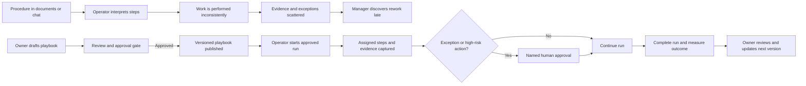

# Business Requirements Document (BRD-lite): Playbook Feature

**Status**: Draft — discovery required before implementation  
**Owner**: BA Lead (recommended)  
**Last Updated**: 2026-07-11

> “Implement playbook feature” is not yet a sufficiently bounded business requirement. The artifact below uses recommended defaults to make progress and identifies only the decisions that block a responsible PRD and implementation handoff.

## 1. Executive Summary

- **Purpose**: Standardize repeatable operational work so people can discover an approved playbook, execute it consistently, capture ownership and evidence, and measure the outcome.
- **Desired Outcome**: Pilot three high-volume internal playbooks in one business domain, reducing median completion time by 25% while achieving at least 80% completion and 90% required-step adherence within eight weeks of approval.
- **Sponsor**: Head of Operations (recommended default; confirm).
- **Validation Owner**: Operations Excellence Lead (recommended default; confirm).
- **Handoff Owner**: BA Lead. The next accountable team member is the Product Manager, who should not commit the feature to a PRD until the blocking questions below are resolved.

The term “playbook” is assumed to mean a versioned, reusable sequence of business steps with named owners, completion evidence, exception handling, and an approved lifecycle. This is a business definition, not a technical design.

## 2. Provisional Business Objectives

These objectives are recommended defaults and remain provisional until the sponsor confirms the domain and baseline.

### BRD-OBJ-001: Improve repeatable-work cycle time

- **Objective Statement**: Reduce median time to complete the selected playbooks by 25% from a two-week pre-pilot observation baseline within eight weeks of pilot launch.
- **Baseline**: Median elapsed time for the same work items before playbook use, measured by the validation owner.
- **Target**: Median completion time <=75% of baseline for the pilot playbooks.
- **Owner**: Operations Excellence Lead.
- **Candidate PRD link**: REQ-001.
- **SMART Check**: Defines the work, comparison period, target, owner, and deadline; the final work population must be confirmed.

### BRD-OBJ-002: Improve adherence and consistency

- **Objective Statement**: Achieve at least 90% completion of mandatory playbook steps and at least 80% completion of initiated pilot playbook runs within eight weeks.
- **Baseline**: Step adherence and completion are currently not consistently measured; the first two weeks of pilot preparation establish the baseline.
- **Target**: Mandatory-step adherence >=90%; initiated-run completion >=80%.
- **Owner**: Playbook Program Owner (recommended: Operations Excellence Lead).
- **Candidate PRD link**: REQ-002.
- **SMART Check**: Provides measurable operational outcomes while acknowledging the measurement gap.

### BRD-OBJ-003: Maintain controlled execution

- **Objective Statement**: Ensure every published pilot playbook has an accountable owner, review date, version, and documented exception/approval path before use, with zero unreviewed high-risk actions in the pilot.
- **Baseline**: Existing procedures are distributed across documents, chat, and individual knowledge; ownership and review evidence are inconsistent.
- **Target**: 100% of pilot playbooks meet the publication controls before launch; zero high-risk actions proceed without the required human approval.
- **Owner**: Operations Excellence Lead with Security/Compliance consultation where applicable.
- **Candidate PRD link**: REQ-003.
- **SMART Check**: Makes governance a measurable launch condition rather than an implied behavior.

## 3. Current State (AS-IS)

1. Repeatable work is described in documents, chat messages, spreadsheets, or individual memory.
2. Different operators perform the same process in different orders, omit steps, or use stale instructions.
3. Ownership, due dates, exceptions, and approval requirements are not consistently visible.
4. Managers cannot reliably distinguish an unfinished run from a completed run with missing evidence.
5. The organization lacks a common measure of cycle time, adherence, exceptions, and outcome quality.

This creates rework, variable quality, slow onboarding, hidden operational risk, and dependence on a small number of experienced people.

## 4. Future State (TO-BE)

An authorized owner can draft, review, publish, version, and retire a playbook. An operator can start the approved version, see the ordered mandatory and optional steps, know who owns each action, record completion evidence, request an exception, and see what remains. Managers can inspect status and outcomes, while the owner can review usage, adherence, cycle time, and failed or abandoned runs.

The first release should optimize for a narrow, high-value pilot. It should not assume that every procedure is safe to automate or that a playbook is a general-purpose workflow engine.

## 5. Process Diagram

## 6. Stakeholders and Approval Ownership

| Stakeholder | Role | Impact | Approval Needed |
| --- | --- | --- | --- |
| Head of Operations | Recommended sponsor and decision-maker | Owns business priority and cross-team adoption | Yes: scope and pilot gate |
| Operations Excellence Lead | Validation owner and playbook program owner | Defines business baseline, governance, and acceptance | Yes: business requirements and pilot acceptance |
| Product Manager | PRD handoff owner | Converts the approved business outcome into product scope | Yes: PRD intake |
| Playbook author/process owner | Content accountable owner | Owns accuracy, version, review date, and exception path | Yes: publication of each playbook |
| Frontline operators | Primary users | Execute playbooks and report ambiguity or unsafe steps | Consulted; pilot readiness feedback |
| Security/Compliance owner | Risk approver | Reviews sensitive data, privileged actions, and control evidence | Yes when a playbook touches controlled work |
| Data/Analytics owner | Measurement partner | Validates baseline and outcome scorecard | Yes: metric definitions and report |

## 7. Scope and Boundaries

### In Scope — Recommended Pilot

- Three internal, repeatable, high-volume playbooks in one domain selected by the sponsor.
- A business lifecycle of draft, review, publish, execute, review outcome, revise, and retire.
- Named playbook owner, version, review date, mandatory/optional steps, run ownership, completion status, evidence, and exception ownership.
- Human approval for high-risk or irreversible actions.
- Pilot scorecard for starts, completions, mandatory-step adherence, cycle time, exceptions, abandonment, and outcome quality.

### Out of Scope — Recommended Defaults

- Customer-facing automation or external commitments.
- A general-purpose workflow engine, project-management replacement, or organization-wide process catalog.
- Automatic execution of irreversible, privileged, financial, legal, or safety-sensitive actions.
- AI-generated playbooks or autonomous decisions before content ownership and controls are approved.
- Expansion beyond the pilot domain before the sponsor reviews evidence.

### Assumptions

- The organization can nominate one sponsor, one validation owner, and an accountable owner for each pilot playbook.
- The selected work has a repeatable outcome and enough volume to establish a two-week baseline.
- Operators can provide feedback and evidence without exposing data outside approved access boundaries.
- “Playbook” means a guided, governed procedure rather than an arbitrary automation platform.

### Constraints

- No playbook is publishable without an owner, version, review date, and approval status.
- A missing approval cannot be treated as an implicit approval.
- The pilot must preserve the existing business control for sensitive or irreversible actions until Security/Compliance explicitly approves a change.
- Functional behavior and implementation details must be routed to the PRD/SRS after the business boundary is approved.

## 8. Business Value

- **Value Type**: Cycle-time reduction, quality consistency, operational risk reduction, and faster onboarding of new operators.
- **Expected Benefit**: 25% lower median completion time, 90% mandatory-step adherence, fewer avoidable omissions and escalations, and less dependence on undocumented expert knowledge.
- **Benefit Measurement**: Compare the two-week pre-pilot observation with the eight-week pilot using the same work definition; report completion, adherence, cycle time, exceptions, abandonment, and outcome quality.
- **Cost / Tradeoff**: Process discovery, content ownership, review time, training, measurement, and delivery effort. Narrow scope may delay broader coverage, but it protects the ability to validate value and controls.

## 9. Risks and Mitigations

| Risk | Impact | Mitigation | Owner |
| --- | --- | --- | --- |
| “Playbook” is interpreted differently by teams | Scope churn and unusable requirements | Confirm the business definition and pilot domain before PRD handoff | BA Lead |
| Playbooks become stale or have no accountable owner | Operators follow unsafe or incorrect steps | Require owner, version, review date, approval status, and review reminders | Playbook Program Owner |
| The feature encourages unsafe automation | Irreversible or privileged action occurs without judgment | Keep high-risk actions human-approved and involve Security/Compliance before expansion | Security/Compliance owner |
| The pilot measures activity rather than value | False success and poor investment decisions | Use baseline-relative cycle time, adherence, completion, and outcome-quality metrics | Data/Analytics owner |
| Operators bypass the playbook | Benefits and evidence are lost | Choose high-volume pilot work, involve operators in design, and measure adoption and abandonment | Operations Excellence Lead |

## 10. Blocking BA Questions — Recommended Defaults

These are the only decisions currently blocking a reliable PRD and implementation commitment. The defaults can be accepted explicitly and revised later through change control.

1. **What business domain and primary users are in scope?**  
   **Recommended default**: Internal operations users in one domain, with three high-volume repeatable procedures and no external users.

2. **Who is the sponsor, validation owner, and accountable owner for each pilot playbook?**  
   **Recommended default**: Head of Operations as sponsor, Operations Excellence Lead as validation owner, Product Manager as PRD handoff owner, and one named process owner per playbook. Security/Compliance is an approver only when the playbook touches controlled work.

3. **What outcome makes the feature worth funding?**  
   **Recommended default**: Establish a two-week pre-pilot baseline and target 25% lower median completion time, 80% run completion, and 90% mandatory-step adherence within an eight-week pilot.

4. **What lifecycle and control boundary must the feature support?**  
   **Recommended default**: Draft -> review -> publish -> execute -> outcome review -> revise/retire; every published playbook has an owner, version, review date, and explicit approval status, and high-risk actions remain human-approved.

5. **What is the delivery boundary and acceptance window?**  
   **Recommended default**: Approve a single-domain pilot, validate results within five business days of the eight-week pilot readout, and defer broader rollout until the sponsor accepts the scorecard and risk review.

## 11. Glossary

| Term | Meaning | Owner |
| --- | --- | --- |
| Playbook | A versioned, governed procedure that guides repeatable work and records ownership, status, evidence, and exceptions | Playbook Program Owner |
| Playbook run | One execution instance of a published playbook for a specific work item | Operations Excellence |
| Mandatory step | A step required for a run to be considered complete | Process owner |
| Exception | An approved deviation from the published procedure with a reason, owner, and resolution record | Process owner |
| High-risk action | An action that can materially affect access, money, legal obligations, safety, or irreversible data/system state | Security/Compliance owner |

## 12. PRD Handoff Notes

- Candidate PRD requirement links:
  - **REQ-001**: The product scope must support execution of an approved, versioned playbook and measurement of cycle time by run.
  - **REQ-002**: The product scope must capture mandatory-step adherence, ownership, completion evidence, exceptions, and abandonment.
  - **REQ-003**: The product scope must enforce publication governance and explicit human approval for high-risk actions.
- Open decisions: answers to the five blocking questions; named pilot playbooks; baseline data source; definition of outcome quality; evidence and retention policy; notification/escalation owners.
- Functional behavior, data contracts, integrations, authorization details, and implementation sequencing belong in the PRD/SRS after BA approval.

## 13. Outcome Report Seed

- **feature_status**: `blocked for implementation - BRD-lite awaiting BA decisions`
- **requirement_trace**: `BRD-OBJ-001 -> REQ-001; BRD-OBJ-002 -> REQ-002; BRD-OBJ-003 -> REQ-003`
- **Completed evidence**: Recommended business definition, provisional SMART objectives, AS-IS/TO-BE, pilot scope fence, stakeholder map, risk controls, glossary, and next-step questions.
- **Missing evidence**: Confirmed domain/users, named sponsor and owners, baseline data, pilot playbooks, outcome-quality definition, and approval boundary.
- **Decision needed**: Resolve the five blocking BA questions; “use recommended defaults” is a sufficient decision for the next workflow if the sponsor accepts the stated scope.
- **Recommended next workflow**: `plan-feature` after the BA Lead records answers and the sponsor/validation owner approve the BRD-lite.

