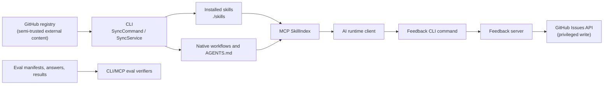

# Codebase Knowledge

**Coverage:** partial deep map of the TypeScript monorepo as reviewed on `feat/runtime-skill-quality-hardening` at `1c86df8a801d`. This document distinguishes source facts from inferences and intentionally does not claim deployed-runtime completeness.

## Purpose and evidence

`agent-skills-standard` is a standards registry plus three runtimes:

- the **CLI** discovers a GitHub registry, syncs skills/workflows into agent-native local paths, and updates routing artifacts;
- the **MCP package** serves the installed local rules and workflow content to AI clients at runtime;
- the **feedback server** accepts skill-feedback submissions and creates GitHub issues.

The principal source of truth for skills is `skills/`; canonical workflows are `.agents/workflows/`; transforms export them into tool-specific paths. This is documented in [ARCHITECTURE.md](../../ARCHITECTURE.md#L1) and implemented by [SyncService](../../cli/src/services/SyncService.ts#L23).

## Component map

| Component | Owner/boundary | Fact evidence |
|---|---|---|
| CLI | `cli/`; orchestrates local sync/configuration. | [CLI entrypoint](../../cli/src/index.ts#L38), [SyncService](../../cli/src/services/SyncService.ts#L54). |
| Registry access | GitHub API/raw content adapter. | [GithubService](../../cli/src/services/GithubService.ts#L32). |
| Skill/workflow exports | Agent-specific filesystem projection. | [SkillSyncService](../../cli/src/services/SkillSyncService.ts#L69), [WorkflowSyncService](../../cli/src/services/WorkflowSyncService.ts#L173). |
| MCP | Reads installed local skills/workflows; default transport is stdio. | [MCP entrypoint](../../mcp/src/index.ts#L8), [server builder](../../mcp/src/server.ts#L130). |
| Feedback server | Stateless NestJS API; owns external GitHub Issue creation. | [AppModule](../../server/src/app.module.ts#L9), [FeedbackService](../../server/src/feedback/feedback.service.ts#L15). |
| Evaluation tooling | Filesystem-backed manifest/transcript/results verification in three implementations. | [repository scorer](../../scripts/evals/scorer.ts#L1), [CLI verifier](../../cli/src/services/EvalsVerifier.ts#L1), [MCP verifier](../../mcp/src/services/EvalsIndex.ts#L1). |

## Critical flows and state ownership

### 1. Skill synchronization

**Fact:** `SyncCommand` loads `.skillsrc`, reconciles configuration, assembles remote assets, writes local assets, then applies indexes ([sync.ts](../../cli/src/commands/sync.ts#L43)). `SkillSyncService` resolves each configured category/ref, walks the GitHub tree, downloads skill files, and writes agent-specific paths ([SkillSyncService.ts](../../cli/src/services/SkillSyncService.ts#L18), [SkillSyncService.ts](../../cli/src/services/SkillSyncService.ts#L122)).

**State owner:** consumer-project filesystem: `.skillsrc`, `.<agent>/skills`, generated `_INDEX.md`, and `AGENTS.md`. The remote registry owns the fetched content; it is not copied to a database.

### 2. Workflow synchronization

**Fact:** workflow discovery uses the registry's default branch, filters selected workflow names, downloads markdown, transforms it for each agent, and writes native invocation files ([WorkflowSyncService.ts](../../cli/src/services/WorkflowSyncService.ts#L95), [WorkflowSyncService.ts](../../cli/src/services/WorkflowSyncService.ts#L202)).

**Caution:** skill categories may be version-tagged in `.skillsrc`, but workflow fetching is default-branch based. Treat this as a deliberate trust-policy decision, not an accidental implementation detail.

### 3. MCP rule serving

**Fact:** `buildServer` constructs a `SkillIndex`, `SessionTracker`, and registered tools including file/keyword rule loads, workflow reads, compliance, telemetry, and eval verification ([server.ts](../../mcp/src/server.ts#L130)). Returned skill content is read from the local installed path and recorded in session telemetry ([tools/index.ts](../../mcp/src/tools/index.ts#L758)).

**State owner:** the installed local registry is durable; `SessionTracker` is process-local and resets with the MCP process ([SessionTracker.ts](../../mcp/src/services/SessionTracker.ts#L45)).

### 4. Feedback delivery

**Fact:** feedback input flows through `POST /feedback` -> DTO -> `FeedbackService.createIssue` -> GitHub Issues API ([feedback.controller.ts](../../server/src/feedback/feedback.controller.ts#L15), [feedback.service.ts](../../server/src/feedback/feedback.service.ts#L40)).

**State owner:** GitHub Issues is the durable sink; the server has no local persistence or queue. This makes GitHub availability and token permission part of the request's synchronous availability boundary.

### 5. Eval-run verification

**Fact:** verifiers read `manifest.json`, `results.json`, local `skills/*/evals/evals.json`, and answer transcripts; they recompute baseline and with-skill pass rates ([EvalsVerifier.ts](../../cli/src/services/EvalsVerifier.ts#L93)).

**Caution:** current implementation treats missing answer files as omitted rather than invalid, so `verified` means matching recomputed rates, not a complete evidence set.

## Interaction and blast-radius matrix

| Shared asset / contract | Producers | Consumers | Relationship | Blast radius |
|---|---|---|---|---|
| `.skillsrc` | User/CLI init | CLI sync, MCP config install | Fact; config controls registry, agents, categories, workflow set, MCP scope. | Bad registry/ref can affect every synced agent surface. |
| `skills/metadata.json` | Registry maintainers | CLI index generation, validators, MCP index | Fact; metadata controls routing/tier behavior. | A routing error affects which rules agents load. |
| `.agents/workflows/*.md` | Workflow authors/remote registry | Workflow transforms, MCP workflow reader, multiple agent runtimes | Fact. | One unsafe/stale workflow exports to several agents. |
| `AGENTS.md` / `_INDEX.md` | Index generator | Human/agent routing | Fact. | Broken generation degrades all skill discovery in a project. |
| GitHub credentials | Runtime environment | CLI API access, feedback server | Fact. | Server token misuse creates external GitHub effects; CLI token exposure affects registry access. |
| Eval manifest/results/transcripts | Eval workflow | CLI/MCP verifiers, CI | Fact. | Missing/inconsistent evidence can mislead quality decisions. |
| Deployed MCP HTTP ingress | Deployment owner | AI clients | Unknown. | If exposed without authentication, local project instructions may be disclosed. |

## Trust boundaries

- **User input:** feedback DTO fields and local `.skillsrc` values.
- **External integration:** GitHub API/raw GitHub content and GitHub Issues API.
- **Credentials:** `GITHUB_TOKEN` in CLI/server runtime; actual scope unknown.
- **Agent tools:** MCP reads local skill/workflow content and emits it into model context. The server itself does not invoke shell or filesystem-write tools for callers.
- **Privileged job:** feedback issue creation is the only reviewed runtime action that spends a server-side credential on an external write.

## Change cautions

1. Preserve `skills/` as source of truth; generated agent surfaces must remain transform outputs.
2. Treat workflow and skill content as executable guidance for agents, not passive documentation. Pin or attest provenance if consumer projects require reproducibility.
3. Keep CLI, MCP, and repository eval scoring behavior synchronized. The duplicated verifier code is a known drift hazard.
4. Do not change feedback route behavior without considering token scope, client authentication, rate limiting, and GitHub failure behavior together.
5. When changing routing metadata, verify the generated `_INDEX.md` and `AGENTS.md` in a temporary consumer project, not just unit tests.

## Risks

| Status | Risk |
|---|---|
| Confirmed | Feedback server allows anonymous triggering of its GitHub issue creation authority. See [security review](../../artifacts/security-review.md#h-01--unauthenticated-feedback-endpoint-can-spend-github-issue-authority). |
| Confirmed | Server E2E/test configuration is not runnable, so API behavior is weakly protected. |
| Confirmed | Eval verification accepts omitted transcripts in rate-only comparisons. |
| Needs validation | Workflow default-branch sync may be an intentional mutable control plane or a missing reproducibility/security policy. |
| Needs validation | HTTP MCP mode requires deployment ingress evidence. |

## Glossary

- **Registry:** GitHub repository providing skill definitions and workflow markdown.
- **Skill:** a `SKILL.md` rule package with metadata/triggers and optional references/evals.
- **Workflow:** portable procedure exported to agent-native invocation formats.
- **Router index:** compact `AGENTS.md` section that points agents to category `_INDEX.md` files.
- **MCP:** Model Context Protocol server that returns local project rules and workflow content.
- **Eval run:** manifest plus prompts, answer transcripts, and results used to measure skill impact.

## Coverage and next-read queue

**Covered:** all package manifests; main CLI sync path; registry, skill/workflow synchronization; MCP entry/server/index/tool behavior; feedback server routes/services; CI/release configuration; test and validation outputs.

**Not fully covered:** all 280 skill bodies, generated bundles, GitHub Actions execution logs, deployed feedback/MCP configuration, live GitHub credential scopes, and external registry history.

**Next reads, in order:**

1. Deployment environment and secret-permission configuration for the feedback server.
2. A clean CI run after server tests and formatting are repaired.
3. Registry release/provenance policy for workflow content.
4. A parity test plan for repository, CLI, and MCP eval verifiers.
