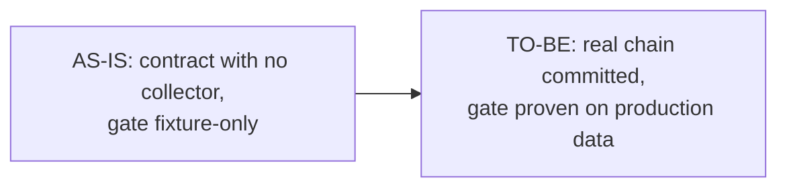

# Business Requirements Document (BRD-lite): SDLC Metrics Report

**Status**: Draft | **Owner**: HoangNguyen0403 | **Last Updated**: 2026-09-23

## 1. Executive Summary

- **Purpose**: `skills/common/common-sdlc-metrics/SKILL.md` defines a delivery-metrics reporting
  contract but explicitly states it "does not gather provider or CI telemetry itself." No script
  under `scripts/` produces `artifacts/sdlc-metrics.md`. Nothing has ever emitted the report the
  skill describes.
- **Desired Outcome**: `artifacts/sdlc-metrics.md` exists, is emitted deterministically from
  committed artifacts and git history at a workflow terminal state, and every value in it either
  cites its source or is marked unavailable with a reason.
- **Sponsor**: HoangNguyen0403 (repo maintainer, sole CODEOWNER per `.github/CODEOWNERS`).
- **Validation Owner**: HoangNguyen0403.

## 2. Business Objective

- **Objective ID**: BRD-OBJ-001
- **Objective Statement**: Delivery flow and cost are reportable from committed artifacts and git
  history, with no additional inference spend.
- **Baseline**: `pnpm audit:trace` exits 0 today only because it hits the fail-open branch — "no
  requirement sources found: docs/brd/ and docs/prd/ are absent" — meaning the deterministic
  requirement-trace gate that shipped last week has never validated a real BRD -> REQ -> AC -> SRS
  chain. `artifacts/sdlc-metrics.md` has zero producers and zero committed instances.
- **Target**: One schema-valid, trace-gate-clean requirement chain (this slug,
  `sdlc-metrics-report`) committed and passing `pnpm audit:trace` with zero error-severity issues by
  2026-09-23, doubling as the fixture that proves the gate audits real data instead of an empty
  repo.
- **Owner**: HoangNguyen0403.
- **SMART Check**: Specific (name the exact artifact and script); Measurable (`pnpm audit:trace`
  exit code and per-AC coverage table); Achievable (schema, templates, and gate already exist —
  only the real instance and the producer are missing); Relevant (directly closes the gap named in
  `common-sdlc-metrics` SKILL.md §1); Time-bound (this initiative, single sprint).

## 3. Current State (AS-IS)

- `common-sdlc-metrics/SKILL.md` defines what the report must contain (DORA four, per-stage
  indicators, control bands) and how it must read (cite source, never estimate, no composite
  score) — but is a contract, not a collector. No script reads `git log`, `artifacts/runs/*.json`,
  or `docs/ops/bands.yaml` and renders `artifacts/sdlc-metrics.md`.
- `scripts/trace/index.ts` (the `pnpm audit:trace` gate) and `scripts/outcome/schema.ts` (the run
  record validator) both exist and are unit-tested against fixtures — but against fixtures only.
  `docs/brd/`, `docs/prd/`, and `artifacts/runs/` are absent from the real repo, so the gate has
  never executed its non-fail-open path against production content.
- Every workflow in `.agents/workflows/` already authors `feature_status` values consistent with
  the schema, but no workflow run has ever produced a committed, schema-valid `RunRecord` — the
  format has only ever been checked in isolation by `scripts/outcome/*.test.ts`.

## 4. Future State (TO-BE)

- A committed `sdlc-metrics-report` BRD/PRD/SRS chain exists under `docs/brd/`, `docs/prd/`,
  `docs/srs/`, satisfying `pnpm audit:trace --slug sdlc-metrics-report` with zero error-severity
  issues and full AC coverage — proving the gate audits real requirement chains, not just its own
  fixtures.
- Three schema-valid `RunRecord` instances exist under
  `artifacts/runs/sdlc-metrics-report/`, one per workflow stage that produced this chain
  (`brainstorm-feature`, `plan-feature`, `design-solution`), proving `pnpm audit:trace:records`
  (`scripts/outcome/index.ts --records`) validates committed, non-fixture data.
- A sibling initiative (tracked separately, same slug) builds the producer script that reads these
  committed artifacts and git history to emit `artifacts/sdlc-metrics.md` per the SKILL.md
  contract; this BRD/PRD/SRS chain is that producer's first real consumer-facing proof and
  regression fixture.

## 5. Process Diagram (Optional)

## 6. Stakeholders

| Stakeholder | Role | Impact | Approval Needed |
| --- | --- | --- | --- |
| HoangNguyen0403 | Repo maintainer / CODEOWNER | Owns whether `pnpm audit:trace` is trusted as a merge gate | yes |
| Skill authors (all categories) | Consumers of `common-sdlc-metrics` | Depend on the report being real, not aspirational | no |
| Downstream agent workflows | Producers of future `RunRecord`s | Need one real, schema-valid example to imitate | no |

## 7. Scope And Boundaries

- **In Scope**: BRD/PRD/SRS documents for slug `sdlc-metrics-report`; three `RunRecord` instances
  for `brainstorm-feature`, `plan-feature`, `design-solution`.
- **Out of Scope**: Building the `artifacts/sdlc-metrics.md` producer script itself (a sibling
  initiative, same slug, tracked in `scripts/`); editing `scripts/trace/*` or
  `scripts/outcome/*`; editing `docs/ops/bands.yaml` or `docs/ops/*`.
- **Assumptions**: `scripts/trace/index.ts` and `scripts/outcome/schema.ts` are correct as shipped;
  this initiative treats them as the acceptance oracle, not as editable.
- **Constraints**: No fabricated cost data — every `RunRecord.cost` in this initiative uses
  `source: "unavailable"` because no host-measured token/cost data exists for the sessions that
  produced this chain.

## 8. Business Value

- **Value Type**: Risk / Compliance (a merge gate that has never run against real data is a false
  sense of safety) plus Cost (a metrics contract with no producer cannot prevent silent token
  waste).
- **Expected Benefit**: Converts `pnpm audit:trace` from an untested fail-open no-op into a proven
  gate with a committed passing fixture; unblocks the sibling producer initiative by giving it a
  real BRD -> REQ -> AC -> SRS chain and IDs to report against.
- **Cost / Tradeoff**: One agent session's authoring time; zero runtime/CI cost (documents only,
  no code path added).

## 9. Risks

| Risk | Impact | Mitigation | Owner |
| --- | --- | --- | --- |
| Trace-gate table conventions (e.g. first-table-cell = declaration) are easy to violate by accident, producing false `duplicate-id`/`orphan-*` errors | Blocks merge; erodes trust in the gate | Validate against `scripts/trace/__fixtures__/clean/` conventions before treating any gate failure as a gate bug | HoangNguyen0403 |
| Sibling producer initiative ships before or diverges from these IDs | Producer cites wrong REQ/AC/SRS ids, breaking traceability | IDs fixed and shared across both initiatives before either starts (see PRD §11) | HoangNguyen0403 |

## 10. Glossary

| Term | Meaning | Owner |
| --- | --- | --- |
| Control band | A rolling-window threshold in `docs/ops/bands.yaml` that routes a breach to an owner at a declared tier | HoangNguyen0403 |
| Run record | A schema-valid JSON file under `artifacts/runs/<slug>/` capturing one workflow run's requirement trace, evidence, and cost | HoangNguyen0403 |
| Trace gate | `scripts/trace/index.ts` (`pnpm audit:trace`), the deterministic BRD -> REQ -> AC -> SRS validator | HoangNguyen0403 |

## 11. PRD Hand-off Notes

- Candidate PRD requirement links: REQ-001, REQ-002, REQ-003.
- Open decisions for PRD: exact SRS card count and scope split (fixed at four: CLI contract, input
  readers, band evaluation, output structure) — see `docs/srs/srs-sdlc-metrics-report.md`.
